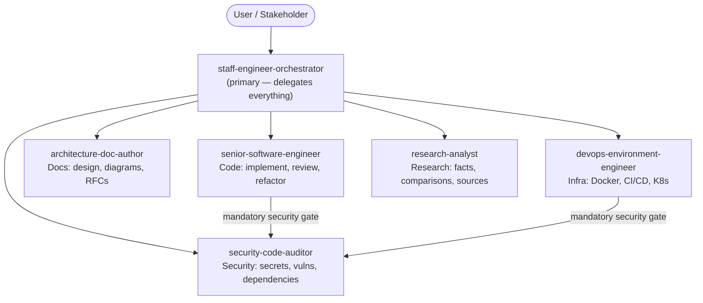

# agents-md

A repository for versioning and sharing agents and skills following the
specifications at https://agents.md and https://agentskills.io.

## What this repo is
Collection of agent specifications in Markdown under the `agents/` folder.
Each file documents an agent's purpose, responsibilities, and operational rules
(frontmatter + human-readable guidance).

## Architecture

The system follows a **delegation-first** pattern: one orchestrator agent receives all incoming requests, decomposes them into subtasks, and delegates each subtask to the most appropriate specialist. The orchestrator **never** executes implementation tasks — it only produces coordination artifacts (plans, task breakdowns, status summaries). It performs work directly only when no specialist agent covers the task category.

Some specialists also delegate to each other. Both the senior software engineer and the DevOps engineer **must** route their outputs through the security auditor before finalizing.



## Agents included

### Opencode

#### Orchestrator (primary)
- [staff-engineer-orchestrator.md](./opencode/agents/staff-engineer-orchestrator.md) — Staff-level orchestrator: intake, decompose, delegate. Never writes code; delegates to specialists and validates their outputs.

#### Specialists (sub-agents)
- [senior-software-engineer.md](./opencode/agents/senior-software-engineer.md) — Senior engineer: implement, review, refactor with SOLID/Clean Architecture practices. Delegates to security auditor after implementation.
- [security-code-auditor.md](./opencode/agents/security-code-auditor.md) — Security auditor: detect secrets and dependency vulnerabilities.
- [architecture-doc-author.md](./opencode/agents/architecture-doc-author.md) — Architecture author: design docs, mermaid diagrams, migration plans.
- [devops-environment-engineer.md](./opencode/agents/devops-environment-engineer.md) — DevOps engineer: Docker/Containerfile, CI/CD, Kubernetes manifests. Delegates container specs to security auditor.
- [research-analyst.md](./opencode/agents/research-analyst.md) — Research analyst: fact-checking, API research, technology comparisons, documentation review. Research only — does not write code.

#### Commands

- [cleanup-slop.md](./opencode/commands/cleanup-slop.md) — Removes AI slop from session-changed files: unsolicited code comments and redundant documentation. Run with `/cleanup-slop`.

#### How to use
- Clone this repository
- Make a symlink from opencode expected agent directory to the `opencode/agents/` folder in this repo. For example, if your opencode expects agents in `~/.config/opencode/agent`, run:

  ```bash
  ln -s path/to/this-repo/opencode/agents ~/.config/opencode/agent
  ```

- Similarly, symlink the commands directory. For example, if opencode expects commands in `~/.config/opencode/commands`, run:

  ```bash
  ln -s path/to/this-repo/opencode/commands ~/.config/opencode/commands
  ```


## Contributing
1. Create a branch: `git checkout -b feat/add-my-agent`.
2. Add your agent spec as `agents/<name>.md`. Follow the examples already in `agents/` (frontmatter, description, responsibilities, rules).
3. Open a PR with a short description, usage examples, and a QA checklist.

## License
This repository is available under the MIT License.
